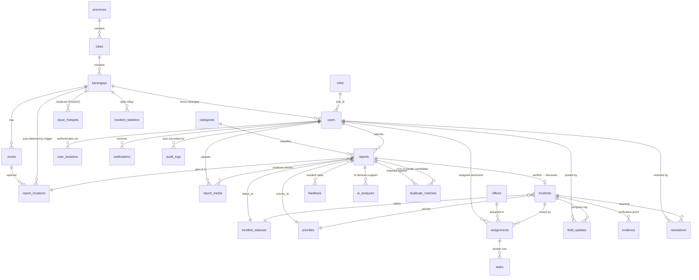

# Entity-Relationship Diagram — AI Barangay Problem Mapper

Generated from `database/schema/`. All PKs are UUIDs (`uuid-ossp`) unless
noted; all tables carry `created_at` / `updated_at`.

## Core tables

| Area | Tables |
|---|---|
| RBAC | `roles`, `permissions`, `role_permissions`, `users`, `user_sessions` |
| Geography | `provinces`, `cities`, `barangays` (PostGIS `center_point`, `boundary`), `zones` |
| Reports | `reports` (RPT-YYYY-NNNNNN), `report_locations` (PostGIS point, lat/lng), `report_media` |
| Incidents | `incidents` (INC-YYYY-NNNNNN), `assignments`, `tasks`, `field_updates`, `evidence`, `resolutions`, `feedback` |
| AI layer | `ai_analyses` (decision support only), `ai_insights`, `duplicate_matches` |
| Org | `offices` |
| Ops | `notifications`, `audit_logs` |
| Analytics | `incident_statistics`, `issue_hotspots` |
| Config | `system_settings` (key-value) |

## Key invariants

- **`report_locations.location`** is derived: the app writes lat/lng and the
  `sync_report_location_geometry()` trigger builds the PostGIS point and
  auto-detects the barangay (boundary match, else nearest center).
- **Report → incident is 1:0..1**; incident status changes mirror onto the
  report by trigger, and the numbering triggers mint `RPT-`/`INC-` numbers.
- **`ai_analyses` is advisory**: no trigger or policy lets AI change a
  report's status — only staff actions do.
- **Views** (`v_resident_reports`, `v_barangay_review_queue`,
  `v_incident_board`, `v_hotspot_map`, `v_barangay_performance`,
  `v_audit_status_changes`) are `WITH (security_invoker = true)` so RLS
  applies through them.
- **RLS** on reports/media/incidents/assignments/tasks/field updates/
  evidence/resolutions/feedback/notifications/duplicate matches — driven by
  `request.user_id` / `request.role_name` / `request.barangay_id` session
  variables set per transaction by the API.

See `database/schema/*.sql` for full column definitions and
`database/policies/rls.sql` for the policy matrix.
